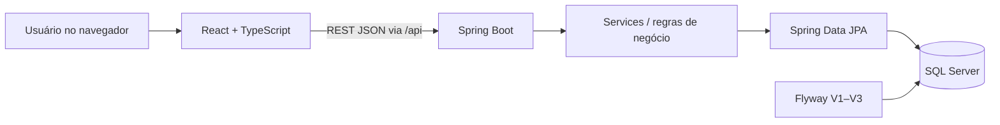

# SGAC — Sistema Integrado de Gestão de Aquisições e Suprimentos

**Protótipo funcional de ERP para gestão de aquisições**, com cadastro de fornecedores e centros de custo, solicitações com múltiplos itens, tramitação de aprovações, histórico e indicadores operacionais.

Projeto independente de engenharia de software, desenvolvido para explorar **análise de requisitos, modelagem relacional, regras de negócio, desenvolvimento full stack e documentação técnica**. O cenário é simulado: o SGAC **não foi implantado em uma organização** e não é um produto pronto para produção.


<p align="center"><em>Painel do ambiente local com dados fictícios usados na demonstração.</em></p>

## Visão geral

- **Dados mestres:** departamentos, fornecedores e centros de custo; edição e desativação lógica para preservar referências históricas.
- **Solicitações de aquisição:** múltiplos itens, quantidades, preços e valor total calculado no backend.
- **Fluxo de aprovação:** `RASCUNHO → PENDENTE → APROVADA / REJEITADA`, com validações de transição.
- **Histórico funcional:** registro de criação, envio e decisão (sem identidade autenticada do aprovador).
- **Acompanhamento:** dashboard, listagens, busca, filtros e indicadores oriundos da API e do SQL Server.
- **API documentada:** contratos REST disponíveis via Swagger UI.

### Telas

| Solicitações de aquisição | Central de aprovações |
| --- | --- |
|  |  |

| Centros de custo | Dashboard |
| --- | --- |
|  |  |

> As capturas mostram um conjunto específico de dados de teste, e não resultados de uma instituição real. Os recursos visualizados são os disponíveis no protótipo local.

## Tecnologias

| Camada | Stack |
| --- | --- |
| Interface | React 19, TypeScript, Vite 7, Tailwind CSS 4, TanStack Query, React Router 7 |
| API | Java 21, Spring Boot 4.1.1, Spring Web MVC, Spring Data JPA, Bean Validation |
| Banco de dados | Microsoft SQL Server 2022 Developer, Docker Compose |
| Schema | Flyway, migrações V1–V3, chaves estrangeiras e constraints |
| Testes | JUnit, Mockito e Bean Validation |
| Documentação | Swagger/OpenAPI, requisitos funcionais, modelo ER e diagramas Mermaid |

A interface utiliza componentes próprios. **Não há autenticação real, autorização por perfil, integração externa com ERP, nem validação completa dos dígitos verificadores de CNPJ.**

## Arquitetura



As mudanças de estado e o cálculo de valores são realizados no backend; os dados são persistidos no SQL Server. O banco é inicializado e evoluído por migrações versionadas. Para detalhes, consulte [Arquitetura e fluxos](docs/04-arquitetura-e-fluxos.md) e [Modelo de dados](docs/03-modelo-de-dados.md).

## Como executar localmente

**Pré-requisitos:** Java 21 ou superior, Node.js 22 ou superior, Docker Desktop com Compose e Git. Comandos demonstrados no **Git Bash (Windows)**.

### 1. Banco de dados

Na raiz do repositório, copie `.env.example` para `.env` e configure uma senha forte para `MSSQL_SA_PASSWORD`. **Não versione `.env`.** Se já tem um volume SQL Server, reutilize a senha original, pois mudar o `.env` não altera a senha dentro do banco existente.

```bash
docker compose up -d
docker compose ps
```

Verifique se o banco `SGAC_DB` existe:

```bash
docker compose exec -T sqlserver bash -c '/opt/mssql-tools18/bin/sqlcmd -S localhost -U sa -P "$MSSQL_SA_PASSWORD" -C -Q "SELECT name FROM sys.databases"'
```

Se `SGAC_DB` **não** constar na lista, execute **uma vez**:

```bash
docker compose exec -T sqlserver bash -c '/opt/mssql-tools18/bin/sqlcmd -S localhost -U sa -P "$MSSQL_SA_PASSWORD" -C -b -Q "CREATE DATABASE SGAC_DB"'
```

O SQL Server é exposto somente ao próprio computador, em `127.0.0.1:14333`.

### 2. Backend

Em um terminal:

```bash
cd backend
set -a
source ../.env
set +a
./mvnw spring-boot:run
```

- Health check: `http://localhost:8080/api/health`
- Swagger UI: `http://localhost:8080/swagger-ui/index.html`

### 3. Frontend

Em outro terminal:

```bash
cd frontend
npm ci
npm run dev
```

Interface em `http://localhost:5173`. O Vite utiliza proxy para o backend local, portanto ambos precisam estar ativos para os dados aparecerem.

## Testes e validação

```bash
# Dentro de backend (com o ambiente configurado)
./mvnw test

# Dentro de frontend
npm run build
```

**Última verificação manual informada (09/10/2026):** 13 testes Java passando (0 falhas/0 erros) e build TypeScript + Vite concluído. Também foram testados os cadastros e o fluxo principal via interface. Esses resultados **não equivalem a testes de segurança, carga ou de integração automatizada com SQL Server**.

O repositório contém workflow de CI para testes Java e build de frontend; seu resultado remoto deve ser acompanhado na aba **Actions** após a publicação.

## Demonstração em seis passos

1. Criar um departamento, um fornecedor fictício e um centro de custo vinculado.
2. Registrar uma solicitação com duas linhas de itens.
3. Conferir subtotais e valor total calculados pelo backend.
4. Enviar a solicitação de `RASCUNHO` para `PENDENTE`.
5. Aprovar ou rejeitar e consultar seu histórico.
6. Verificar os indicadores e a listagem no dashboard.

Consulte [Estudo de caso](docs/07-estudo-de-caso.md) para entender o problema simulado, decisões técnicas, resultados e limitações.

## Documentação

- [01 — Contexto, escopo e stakeholders](docs/01-escopo.md)
- [02 — Requisitos e regras de negócio](docs/02-requisitos-e-regras.md)
- [03 — Modelo relacional](docs/03-modelo-de-dados.md)
- [04 — Arquitetura e fluxos](docs/04-arquitetura-e-fluxos.md)
- [05 — Testes, qualidade e limitações](docs/05-testes-e-limitacoes.md)
- [07 — Estudo de caso](docs/07-estudo-de-caso.md)

## Limitações conhecidas e próximos passos

O SGAC é **projeto demonstrativo de estudo independente**, não deve ser disponibilizado como API pública sem novos controles. Para evolução real são necessários: autenticação e autorização com identidades verificadas, usuário SQL de privilégio mínimo (em vez de `sa`), validações adicionais (incluindo CNPJ completo), testes de integração, auditoria de operações administrativas, tratamento de segredos e proteção das conexões em produção.

**Fora de escopo:** estoque, faturamento, pagamentos, licitações, implantação corporativa e integração com outros sistemas ERP. As imagens mostram exclusivamente dados fictícios do ambiente de demonstração.

> Projeto demonstrativo de código e documentação. Este repositório não inclui licença aberta expressa; consulte as condições de uso antes de reutilizar seu conteúdo.
