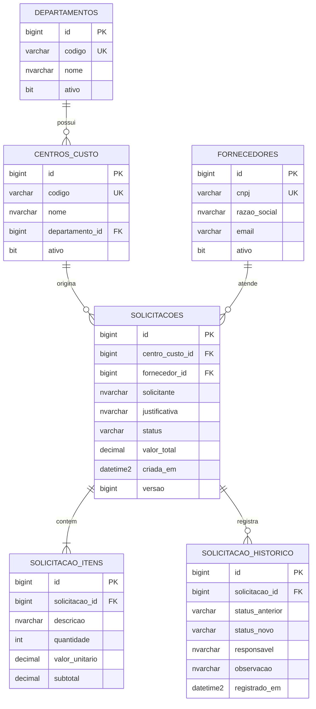

# 03 — Modelo relacional de dados

Diagrama lógico simplificado das tabelas implementadas nas migrações Flyway V1–V3:

> Este diagrama descreve as tabelas principais, não replica todas as constraints e os índices. O modelo executável de referência é o conjunto `backend/src/main/resources/db/migration/V*.sql`.

## Decisões de modelagem

- **Foreign keys** asseguram vínculo entre centros, fornecedores e solicitações;
- **`DECIMAL(18,2)`** evita a imprecisão binária típica de ponto flutuante em valores monetários;
- **`versao`** na solicitação apoia o controle de concorrência otimista do Hibernate (`@Version`);
- **Índices** aceleram consultas típicas por status, data e relacionamentos;
- **Não exclusão física** dos cadastros protege a consistência de referências históricas.

## Evolução do schema

- `V1__criar_tabela_departamentos.sql` — departamentos;
- `V2__fornecedores_centros_custo.sql` — fornecedores e centros de custo;
- `V3__solicitacoes_itens_historico.sql` — solicitações, itens, histórico e índices.

**Nunca edite scripts V1–V3 após aplicados.** Para alterações futuras, crie uma nova migração (`V4__...sql`).
