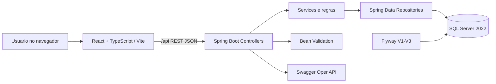
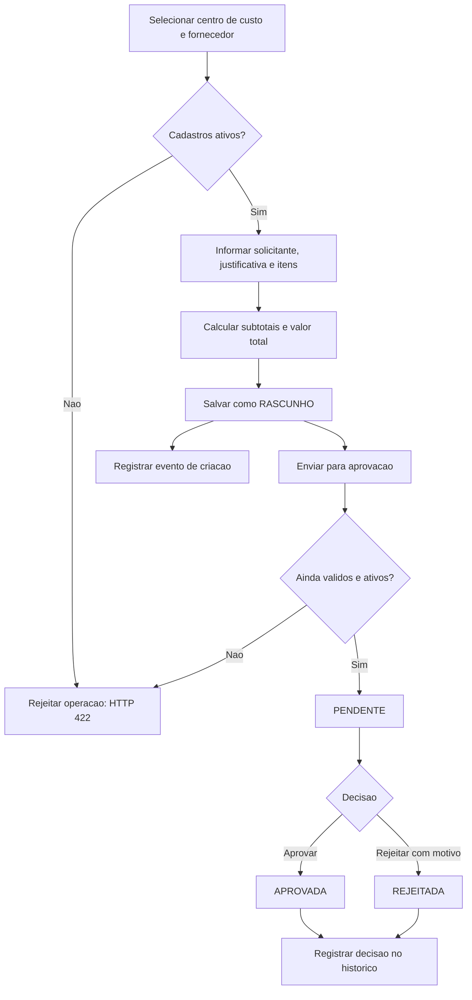

# 04 — Arquitetura e fluxos funcionais

## Arquitetura de alto nível

Na execução local, o Vite encaminha `/api` para o backend na porta 8080. O backend se conecta ao SQL Server pelo driver JDBC em `localhost:14333`.

## Fluxo da solicitação

## Contrato principal da API

| Método | Endpoint | Finalidade |
| --- | --- | --- |
| GET | `/api/departamentos` | Lista departamentos |
| GET | `/api/fornecedores` | Lista fornecedores |
| GET | `/api/centros-custo` | Lista centros de custo |
| GET | `/api/solicitacoes` | Lista resumos |
| POST | `/api/solicitacoes` | Cadastra nova solicitação |
| GET | `/api/solicitacoes/{id}` | Detalhe com itens |
| POST | `/api/solicitacoes/{id}/enviar` | Muda rascunho para pendente |
| POST | `/api/solicitacoes/{id}/aprovar` | Aprova pendente |
| POST | `/api/solicitacoes/{id}/rejeitar` | Rejeita pendente |
| GET | `/api/solicitacoes/{id}/historico` | Consultar trilha funcional |

Os endpoints de cadastro também implementam `POST`, `PUT`, `GET/{id}` e `PATCH/{id}/status`. O Swagger detalha os contratos e payloads.

## Decisões de projeto

- A lógica de aprovação fica nos Services/Entidades, não na interface;
- Valores são calculados no backend, não aceitos como totais enviados pelo navegador;
- As transações mantêm mudança de status e registro de histórico como uma operação;
- Respostas padronizadas diferenciam erros de validação, ausência de recurso e conflitos.
