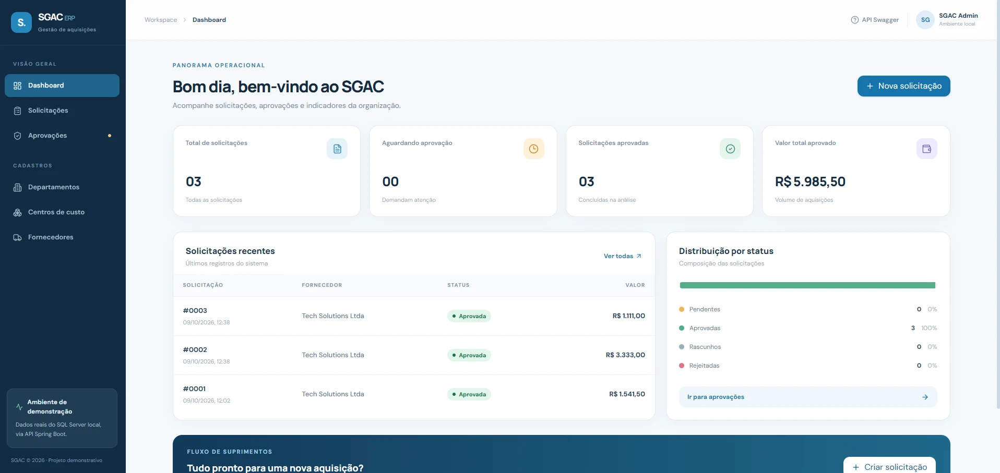
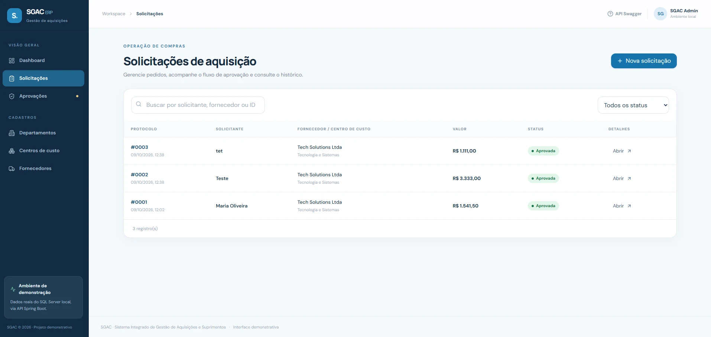
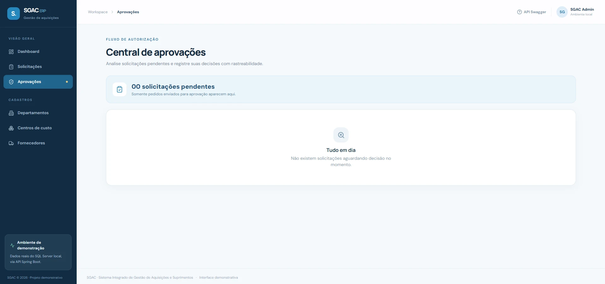
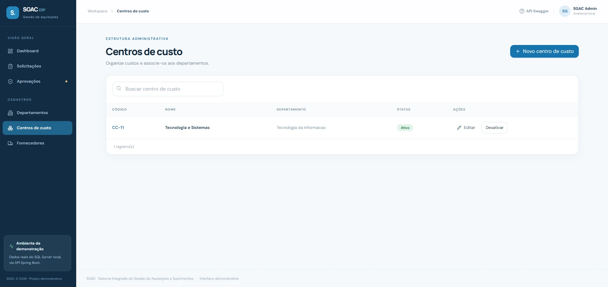

# Estudo de caso — SGAC ERP

> **Natureza:** projeto independente, com problema e usuários simulados. Não houve contratação, implantação, entrevistas reais com stakeholders nem integração com sistemas do Instituto Santos Dumont.

## Contexto e desafio

Solicitações internas de aquisição podem envolver mais de um departamento e exigir conferência de valores, organização dos cadastros e registro das decisões. A hipótese que orientou o SGAC foi: **como tornar um fluxo simples de compra mais rastreável e coerente em um único sistema?**

A solução pretendida não era um ERP amplo de contabilidade/estoque, mas um **recorte viável e demonstrável**: da solicitação de materiais ou serviços até a decisão de aprovação/rejeição, com indicadores de acompanhamento.

## Escopo definido

**Perfis simulados:** solicitante, compras, aprovador, gestor e responsável por cadastros. Os perfis são parte da análise funcional, **não permissões implementadas**.

**Funcionalidades escolhidas:**

1. Cadastrar departamentos, fornecedores e centros de custo;
2. Registrar solicitações com itens e justificativa;
3. Calcular valores no servidor com precisão monetária;
4. Controlar estados `RASCUNHO → PENDENTE → APROVADA/REJEITADA`;
5. Registrar eventos de criação, envio e decisão;
6. Consultar solicitações e consolidar métricas em um painel.

O recorte foi documentado em [escopo](01-escopo.md) e [requisitos](02-requisitos-e-regras.md), com regras e critérios de aceite explícitos.

## Decisões de análise e arquitetura

| Decisão | Motivo | Evidência |
| --- | --- | --- |
| Tratar aprovação como máquina de estados | Evitar decisões em solicitações ainda não enviadas ou já concluídas | Services e `RASCUNHO`, `PENDENTE`, `APROVADA`, `REJEITADA` |
| Centralizar o cálculo monetário no servidor | Não confiar no valor total fornecido pelo cliente | `BigDecimal` no Java e `DECIMAL(18,2)` no SQL Server |
| Relacionar centros a departamentos e solicitações a centros e fornecedores | Manter consistência de dados entre cadastros e processos | Foreign keys nas migrations |
| Desativar em vez de excluir registros administrativos | Preservar referências de solicitações anteriores | Campo `ativo` e endpoints de status |
| Registrar as mudanças no histórico | Dar visibilidade à sequência de eventos | Tabela `solicitacao_historico` e endpoint de histórico |
| Separar API em Controller, Service, Repository e DTO | Isolar validação HTTP, regras e persistência | Pacotes Java no backend |
| Versionar schema com Flyway | Permitir evolução reproduzível do banco | Scripts V1, V2 e V3 |

A modelagem pode ser consultada no [diagrama entidade-relacionamento](03-modelo-de-dados.md) e o fluxo no [diagrama de arquitetura](04-arquitetura-e-fluxos.md).

## A experiência do usuário

O frontend foi organizado em uma navegação lateral com Dashboard, Solicitações, Aprovações e Cadastros. A interface utiliza React/TypeScript, Tailwind CSS, TanStack Query e componentes próprios. Os dados apresentados são obtidos por chamadas REST ao backend local, não por uma base fictícia fixa no navegador.

| Gestão das solicitações | Aprovações |
| --- | --- |
|  |  |

Os registros das imagens são exemplos de demonstração. Os valores de solicitações aprovadas **não representam economia, volume de compras nem resultados de uma organização real**.

## Verificações realizadas

- **Teste manual do fluxo:** cadastro, solicitação com múltiplos itens, envio, aprovação e consulta pelo frontend;
- **Persistência real:** Spring Boot conectado ao SQL Server local via JDBC/JPA;
- **Testes de backend:** 13 testes JUnit aprovados (0 falhas e 0 erros), conforme execução local em 09/10/2026;
- **Build frontend:** `tsc -b && vite build` aprovado em 09/10/2026;
- **Qualidade documental:** requisitos funcionais/não funcionais, regras, arquitetura, migrations e matriz de testes organizados na pasta `docs/`.

**Limite das evidências:** os testes automatizados atuais são sobretudo unitários; não existe comprovação de testes de carga, segurança, integração automatizada SQL Server ou acessibilidade abrangente.

## Aprendizados técnicos e de análise

O projeto demonstrou a diferença entre **fazer telas de CRUD** e **modelar um processo empresarial**: identificar as entidades e seus vínculos, explicitar transições autorizadas, garantir a consistência dos totais e preservar a trilha básica de tramitação. Também ajudou a exercitar a tradução de requisitos simulados em contratos de API, persistência e interface.

## Limitações e evolução planejada

O protótipo não possui login, perfis autenticados ou verificação real da identidade do aprovador. O responsável é um texto informado pelo cliente, logo o histórico é **funcional**, não auditoria segura de identidade. Também não oferece alçadas de aprovação, orçamento, reconciliação de estoque ou integração com TOTVS RM.

Próximos passos possíveis, **não entregues nesta versão**: autenticação/autorização, ampliação dos testes de integração, observabilidade, validação completa de CNPJ, paginação para bases grandes, identidade auditável nas decisões e melhorias de acessibilidade. O **modo escuro** é um refinamento de interface opcional, de prioridade menor que as medidas de segurança e portfólio.

## O que este projeto evidencia para Analista de Sistemas

- **Análise de requisitos:** organização de problema, perfis simulados, RF/RNF e regras de negócio;
- **Banco relacional:** modelagem SQL Server, relacionamentos e migrações;
- **Fluxo de gestão de aquisições:** estados, validações, transações e histórico;
- **Desenvolvimento e documentação:** frontend, API REST e artefatos técnicos;
- **Qualidade:** testes unitários e validação manual de cenários reais dentro do protótipo.

> Este estudo **não equivale a experiência profissional com ERP ou TOTVS RM**. É uma demonstração independente de competências transferíveis.
